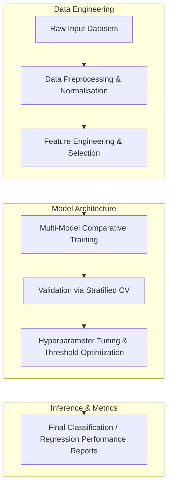

# from Windows PowerShell

[](https://creativecommons.org/licenses/by-nc-nd/4.0/)


This repository implements the research pipeline for the **from Windows PowerShell** project, developed by the Runtime-Slayers research group.

---

## 📊 Pipeline Architecture

The flowchart below visualizes the methodology and execution sequence implemented in this project:



---

## 🔍 Abstract & Research Context


---

## 📊 Key Evaluation Metrics

See the detailed project report for full experimental tables.

---

## 📁 Repository Structure

The project directory consists of the following core structures:
  - `code/` — Pipeline execution scripts and model training modules
  - `figures/` — Plots, charts, and visualizations generated by the pipeline
  - `validation/` — Automated test metrics and results
  - `page_2.png`
  - `page_3.png`
  - `cognitive_core`
  - `outputs_kaggle`
  - `tools`
  - `kaggle_kernel_runs`
  - `page_4.png`
  - `page_5.png`
  - `pytest.ini`
  - `requirements.txt`
  - `ablation_results.json`
  - `page_7.png`
  - `G-NeSAI_Demonstration.ipynb`
  - `page_6.png`
  - `project_content.txt`
  - `ocr_extract.py`
  - `kaggle_kernel_ablation`
  - `experiments`
  - `training`
  - `training_pipeline.py`
  - `tests`
  - `check_dependencies.py`
  - `perception_layer`
  - `extract_images.py`
  - `outputs_kaggle_ablation`
  - `page_10.png`
  - `neuro_symbolic`
  - `.gitignore`
  - `execution`
  - `scripts`
  - `.github`
  - `extract_pdf.py`
  - `eval_model.py`
  - `README_KAGGLE.md`
  - `kaggle_kernel_full`
  - `page_8.png`
  - `kaggle_kernel`
  - `outputs`
  - `data_factory`
  - `notebooks`
  - `extract_pdf2.py`
  - `paper.pdf` — Compiled research manuscript
  - `README.md` — Project documentation and setup guide

---

## 🚀 Setup and Usage

### Prerequisites
* Python 3.8 or higher
* Pip package manager

### Installation
1. Clone this repository:
   ```bash
   git clone https://github.com/Runtime-Slayers/Project-Aether.git
   cd Project-Aether
   ```
2. Install dependencies:
   ```bash
   pip install -r requirements.txt
   ```

### Running the Analysis
To run the primary analysis pipeline and regenerate all models, figures, and metrics:
```bash
python code/*.py
```
*(Look in the `code/` directory for specific pipeline execution files)*

---

## 📄 License and Copyright

This work is licensed under a [Creative Commons Attribution-NonCommercial-NoDerivatives 4.0 International License](https://creativecommons.org/licenses/by-nc-nd/4.0/).

© 2026 Runtime-Slayers / Bhavanam Rajendra Reddy et al. All rights reserved.
